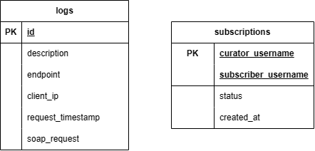

# BNMOBOXD SOAP SERVICE
BNMOBOXD SOAP Service is a backend service for [BNMOBOXD - Curators](https://gitlab.informatika.org/if3110-2023-01-16/bnmoboxd-spa-client). This Service provides backend for handling Subscription on BNMOBOXD Curators.

This service should be used along with:
- [BNMOBOXD REST](https://gitlab.informatika.org/if3110-2023-01-16/bnmoboxd-rest-service)
- [BNMOBOXD App](https://gitlab.informatika.org/if3110-2023-01-16/bnmoboxd)

## Database Schema

## Features
This service provides the following methods:
| ENDPOINT      | NAME   | PARAMETERS                                        |
|---------------|--------|---------------------------------------------------|
| /subscription | get    | `curatorUsername`, `subscriberUsername`           |
| /subscription | getAll | `page`, `take`                                    |
| /subscription | count  | `curatorUsername`                                 |
| /subscription | add    | `curatorUsername`, `subscriberUsername`, `status` |
| /subscription | update | `curatorUsername`, `subscriberUsername`, `status` |

## Requirements
1. Docker

## Installation
1. Install requirements
2. Clone repository
3. By default, this app uses port `8005, 9000` but it can be modified through `docker-compose.yml`.

## Running Application
1. `cd` to repository's root
2. Make a env file `.env.production`
3. Fill the file `.env.production` referring to `env.example`, make sure to include the correct endpoint for the other services. Also don't forget to fill the `email sending` part
4. Open terminal and run `docker compose up -d`

## Task
| 13521044               | 13521047           | 13521107                    |
|------------------------|--------------------|-----------------------------|
| Project Initialization | DB Seeding         | Subscription CRUD           |
| DB Set Up              | Review and Testing | Auth Middleware             |
| Docker                 |                    | Logging Middleware          |
| Email                  |                    | PHP Client                  |
|                        |                    | Update subscriptions on PHP |

## Bonus
1. Docker
2. Email

## Authors
|              Nama              |   NIM    |
| :----------------------------: | :------: |
| Rachel Gabriela Chen           | 13521044 |
| Muhammad Equilibrie Fajria     | 13521047 |
| Jericho Russel Sebastian       | 13521107 |

